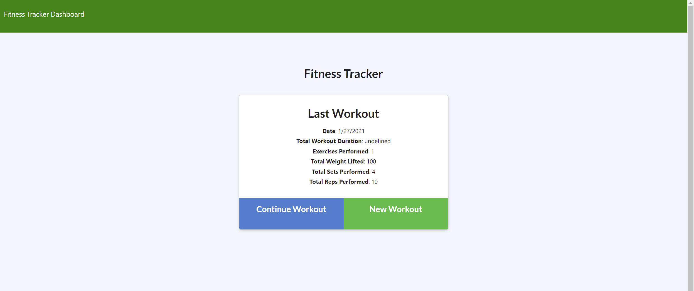
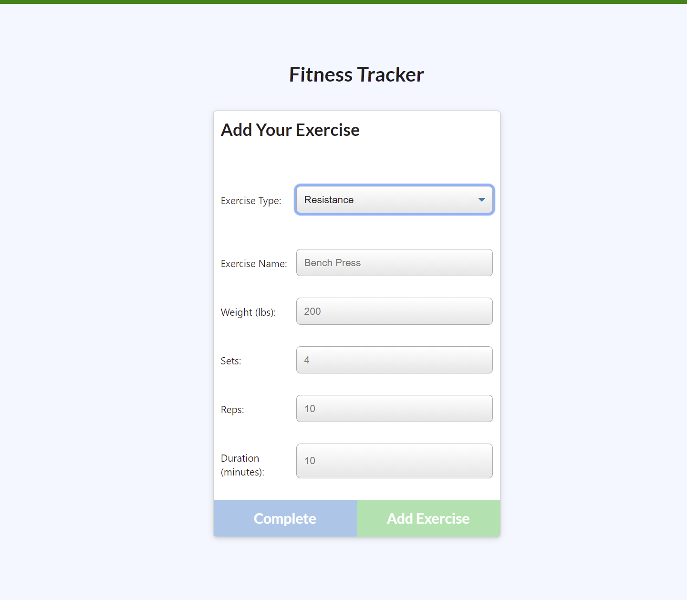
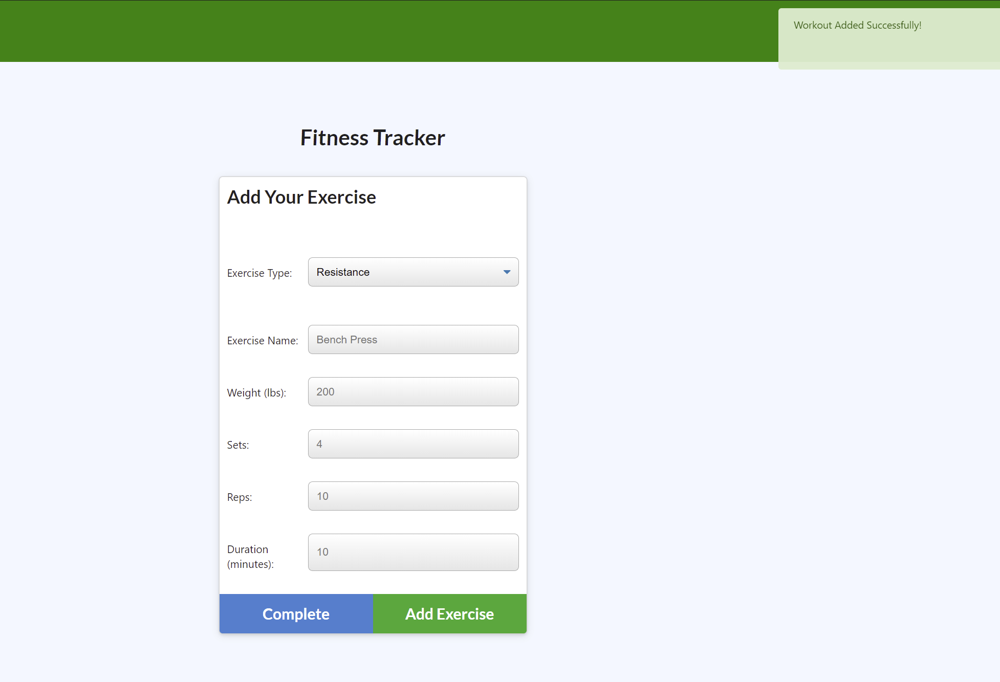
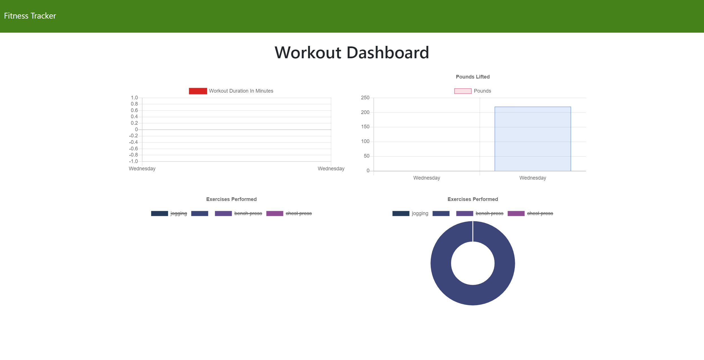

# workout-tracker

## Table of Contents

[Description](https://github.com/preussenfahrer/workout-tracker#Description)

[Usage](https://github.com/preussenfahrer/workout-tracker#Usage)

[Technologies](https://github.com/preussenfahrer/workout-tracker#Technologies)

[License](https://github.com/preussenfahrer/workout-tracker#License)

# Description
Workout-Tracker (_WT_) is a simple to use way to keep up with your personal fitness goals. When you are holding yourself accountable for meeting those goals, there is an increased likelihood that you will meet them. Also, it is a very satisfying feeling to log your activity and see how much you've accomplished. With Fitness-Tracker, this is all within a few clicks! As the images show below, you can input your workout and also see the logs. You're also prompted when a workout is saved successfully and added to your database.

# Usage
Checkout the video link here to see how to use _WT_: https://drive.google.com/file/d/1-mfqF96JJE6aINam-9rdASNiG68_r-ai/view
# Technologies
_WT_ uses mongoose for its database functionality and MongoDB, in addition to the following packages: `express`, `mongoose`, and `morgan`.
# Installation
Begin by running an `npm install` to make sure your dependencies are installed. Also make sure you've got MongoDB and Robo 3T on your machine. Once you've got that done, go to the terminal and check out how it works!
# License

